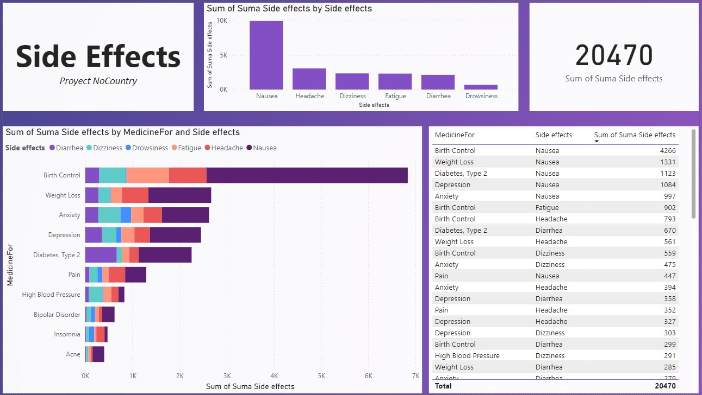
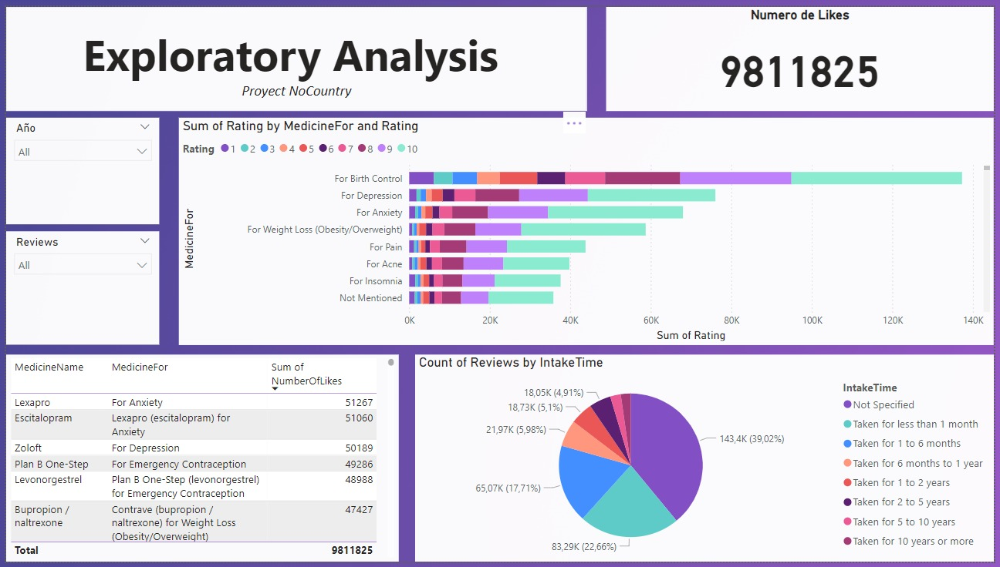

# c19-115-n-data-bi

# **DataSalud: Exploración de Reseñas de Medicamentos y Análisis de Sentimientos**

## Introducción

El análisis de reseñas de medicamentos es fundamental para comprender la experiencia de los usuarios y evaluar la efectividad y satisfacción de los tratamientos farmacéuticos. Con el auge de plataformas en línea donde los consumidores comparten sus opiniones sobre medicamentos, se ha generado una gran cantidad de datos valiosos que pueden ser explotados para obtener insights significativos.  

En este proyecto, titulado **"DataSalud: Exploración de Reseñas de Medicamentos y Análisis de Sentimientos"**, nos enfocamos en el dataset **"DrugRev: A comprehensive customers reviews on drugs purchasing and satisfaction"**, un conjunto de datos  que recopila reseñas de usuarios sobre una amplia variedad de medicamentos. Este dataset, proveniente de drugs.com y meticulosamente limpiado, contiene 392,510 reseñas únicas que incluyen información sobre el nombre del medicamento, la calificación otorgada por el usuario, la credibilidad de la reseña (medida en "me gusta"), la longitud de la reseña, la afección tratada y el tiempo de uso del medicamento.  

El objetivo principal de este proyecto es analizar las opiniones de los clientes que compraron productos farmacéuticos y establecer un modelo predictivo de la satisfacción y efectos secundarios basado en el análisis del dataset. A través de técnicas de análisis descriptivo y modelado predictivo, buscamos identificar patrones y tendencias en las reseñas de los usuarios, evaluar la distribución de las calificaciones y la credibilidad de las reseñas, y explorar la relación entre estas variables y otras características del dataset.  

Al proporcionar insights valiosos sobre la experiencia del usuario con diferentes medicamentos y afecciones, este análisis puede ayudar a mejorar la toma de decisiones en la industria farmacéutica y contribuir a un mejor entendimiento de la satisfacción del paciente y los posibles efectos secundarios de los tratamientos.  

## Stack Tech

- **Lenguaje de programación:** Python
- **Librerías:** Pandas, Numpy, Matplotlib, Plotly, nltk, Sklearn
- **IDE:** Colab Notebooks como entorno de desarrollo
- **Visualización de datos:** Dashboard de Power BI
- **Gestión del código fuente:** GitHub para desarrollo colaborativo en equipo
- **Gestión de equipo:** Google sheets 

## Estructura del Proyecto

El proyecto se divide en dos archivos `.ipynb` principales:

1. **EDA+SideEffects.ipynb:**
   - **Análisis Exploratorio de Datos (EDA):** Se realizó un análisis exploratorio de los datos.
   - **Selección de Categorías:** Se seleccionaron las 10 categorías de medicamentos más relevantes en el dataset:
     - 'Birth Control', 'Depression', 'Anxiety', 'Weight Loss', 'Pain', 'Acne', 'Insomnia', 'Bipolar Disorder', 'Diabetes, Type 2', 'High Blood Pressure'
   - **Análisis de Efectos Secundarios:** Se buscaron palabras clave en los comentarios para identificar efectos secundarios como:
     - 'nausea', 'headache', 'dizziness', 'fatigue', 'drowsiness', 'diarrhea'

2. **AnalisisSentimientos.ipynb:**
   - **Análisis de Sentimientos:** Utilizamos la librería nltk para realizar el análisis de sentimientos de las reseñas de las 10 categorías seleccionadas.
   - **Algoritmos Utilizados:** Se emplearon TextBlob, VADER y BERT para el análisis de sentimientos.
  
## Visualización de Resultados

Para visualizar los resultados de los análisis realizados, hemos creado un dashboard en Power BI y una pequeña aplicación que despliega el modelo predictivo de BERT.

### Dashboard en Power BI

Nuestro dashboard en Power BI muestra una variedad de gráficos e informes que resumen los resultados del análisis exploratorio de datos y el análisis de sentimientos. Aquí se pueden visualizar tendencias, distribuciones de efectos secundarios y comparaciones entre diferentes categorías de medicamentos.

**Muestra del Dashboard:**

**Link al Dashboard:**

[Acceder al Dashboard en Power BI](https://link.a.tu.dashboard)

### Aplicación Predictiva

Hemos desarrollado una aplicación sencilla que utiliza el modelo predictivo de BERT para analizar nuevas reseñas de medicamentos. Esta app permite a los usuarios ingresar una reseña y obtener un análisis de sentimiento en tiempo real.

**Capturas de Pantalla de la Aplicación:**

**Link a la Aplicación:**

[Acceder a la Aplicación Predictiva](https://link.a.tu.aplicacion)

## Colaboradores

A continuación, se presentan los miembros del equipo que contribuyeron a este proyecto, junto con sus roles y enlaces a sus perfiles de GitHub y LinkedIn.

| Nombre                 | Rol                        | GitHub                          | LinkedIn                                                                         |
|------------------------|----------------------------|---------------------------------|----------------------------------------------------------------------------------|
| Kalaumari Mayoral Peña | Project Manager - Data Scientist | [GitHub](https://github.com/kalaumari) | [LinkedIn](https://www.linkedin.com/in/kalaumari-mayoral-pe%C3%B1a-48a49071/)     |
| Yeimmy Morales         | Data Scientist             | [GitHub](https://github.com/yeimmygit11) | [LinkedIn](https://www.linkedin.com/in/yeimmy-morales)                          |
| Gilmer Torres          | Data Analyst               | [GitHub](https://github.com/gilmer-enrique) | [LinkedIn](https://www.linkedin.com/in/gilmer-enrique-torres-ben%C3%ADtez-5b00b786/) |
| Miriam Aguilar         | Data Analyst               | [GitHub](https://github.com/MiriamAguilarP13) | [LinkedIn](https://www.linkedin.com/in/miriampineda02/)                         |

